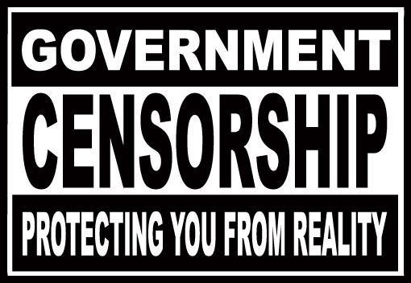
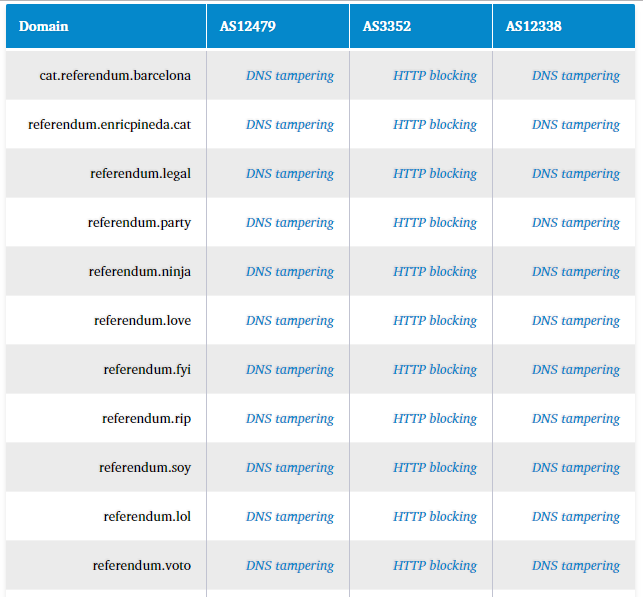
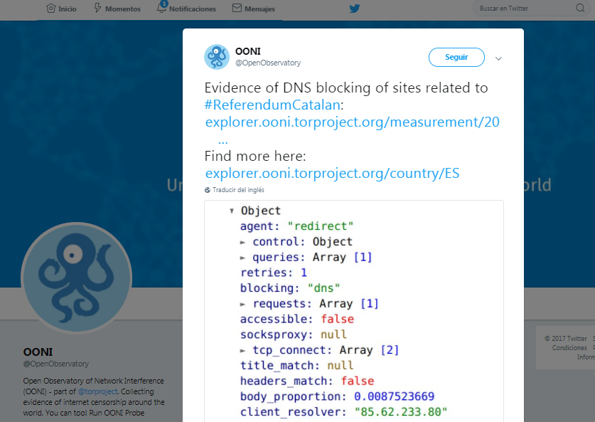
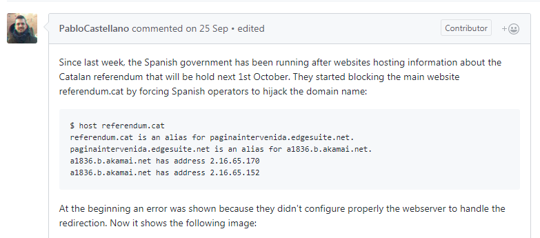
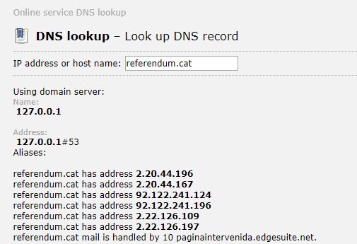
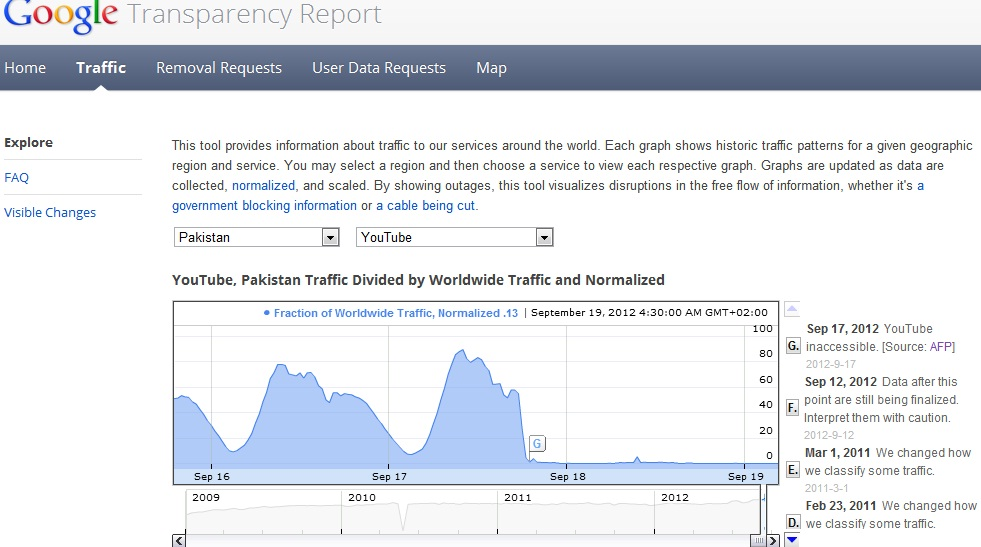
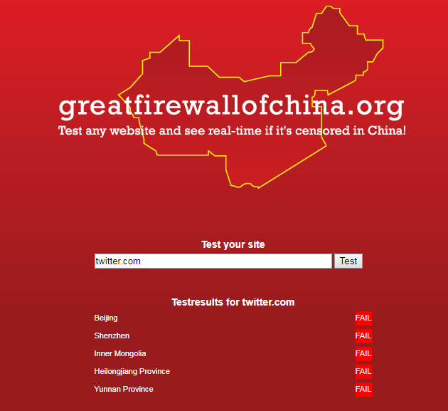

[volver](./)

* [Open Observatory of Network Interference](#open-Observatory-of-network-interference).
* [Técnicas para censurar sitios web](#técnicas-para-censurar-sitios-web)
	* [DNS tampering](#dns-tampering)
	* [Bloqueo de HTTP](#bloqueo-de-http)
	* [Apropiación del dominio CAT](#apropiación-del-dominio-cat)

# Open Observatory of Network Interference

**[OONI](https://ooni.torproject.org/)** [@OpenObservatory](https://twitter.com/openobservatory) (Open Observatory of Network Interference) se definen como un observatorio global de la red para detectar la censura. Es parte del proyecto **[Tor](https://www.torproject.org/)** ([@torproject](https://twitter.com/torproject)).

**OONI** usa software libre para recopilar evidencias de bloqueo de Webs.  

**OONI** confirma el bloque de 25 sitios Web relacionados con el referéndum usando medidas como:

* **“DNS tampering”** (manipulación de DNS)
* **“HTTP blocking”** (bloqueo de HTTP),

Los datos de **OONI** muestran que estos sitios fueron bloqueados cada día desde (al menos) el 25 de septiembre de 2017 (cuando la prueba comenzó) hasta el día del referéndum, el 1 de octubre de 2017.

Para recopilar evidencias que demuestran cómo los sitios asociados al referéndum catalán fueron bloqueados se usa [OONI Probe](https://ooni.torproject.org/install/) (un software gratuito y abierto que cualquiera puede ejecutar para medir el bloqueo de sitios web).

Listado parcial obtenido de OONI con las Webs bloqueadas:

**[referendum.cat](http://referendum.cat/)** fue redirigido al dominio	 **[paginaintervenida.edgesuite.net](http://paginaintervenida.edgesuite.net/)** alojado por Akamai el 13 de septiembre.

**France Telecom Espanña** (AS12479) y **Euskaltel** (AS12338) bloquearon el acceso a sitios mediante la **manipulación de DNS**, mientras que **Telefónica** (AS3352) sirvió páginas de bloque **mediante el uso de proxies transparentes HTTP**. 

Conviene señalar que France Telecom España (AS12479) y Euskaltel (AS12338) no bloquearon ciertos dominios .cat (referendum.cat y ref1oct.cat), probablemente porque estos sitios ya habían sido incautados. Telefónica de España (AS3352), por otro lado, reforzó la censura al servir páginas de bloque para dominios incautados.

A partir del **3 de octubre de 2017**, los siguientes **nombres de dominio son redirigidos a [paginaintervenida.edgesuite.net](http://paginaintervenida.edgesuite.net/)**: piolin.cat, ref1oct.cat, empaperem.cat…

El Tweet publicado por OONI el 26 de Septiembre muestra las evidencias del bloqueo DNS sobre la Web [referendum.party](http://www.referendum.party/).

Todos los dominios .cat han sido retirados como resultado de la orden judicial recibida por Fundacio .cat el 15 de septiembre del Tribunal Superior de Justicia de Cataluña. El director de investigación e información de la organización que dirige el dominio catalán de nivel superior .cat, Pep Oliver, fue detenido el 20 de septiembre y mantenido bajo custodia durante 60 horas.

GitHub [Add urls blocked in Spain related to Catalan referendum](https://github.com/citizenlab/test-lists/issues/221). 

[citizenlab/test-lists: Listado de Webs](https://github.com/citizenlab/test-lists/pull/228/files#diff-e1a59faca632b178f429c9a26c1ce410R32)

Usando el comando host en Linux o su equivalente nslookup en Win podemos comprobar si un nombre de dominio tiene un alias (en este caso el alias seria paginaintervenida.edgesuite.net).

También podemos usar aplicaciones Web que ejecutan la misma consulta http://ping.eu/nslookup/.

https://github.com/citizenlab/test-lists/issues/221

The virtual harassment has been paralleled with physical harassment. Read what EFF wrote about it at https://www.eff.org/deeplinks/2017/09/cat-domain-casualty-catalonian-independence-crackdown

Also interesting reading about technical measures taken beforehand to prevent DDoS and censorship: https://medium.com/@josepot/is-sensitive-voter-data-being-exposed-by-the-catalan-government-af9d8a909482

Collection of data about URL filtering in various countries https://github.com/citizenlab/web-censorship

Gets a simple dump of the Russian Federal Black List of blocked sites from the excellent antizapret.info in a few formats
https://github.com/jakubd/russian-blacklist

https://github.com/jakubd/censorscope
https://github.com/projectbismark/censorscope/wiki/Design-spec

 #Censorscope and #censormetrics for a new #censorship science and historical prospective. Google search engine as a global #censor Dr. (PhD) Miguel Gallardo at www.cita.es Tel. (+34) 902998352 E-mail: miguel@cita.es  
https://docs.google.com/document/d/15Zsn9Zk4UkQ4Hjuk8ibOhqqC-bVEWDVFutyIWFiJyhU/edit

https://sites.google.com/site/censorscope/time-tracker
https://github.com/projectbismark/censorscope

# Técnicas para censurar sitios Web 

## DNS tampering (DNS cache poisoning)

Consiste en intervenir los servidores **DNS**, estos son los que resuelven un nombre de dominio en una dirección IP de red. Normalmente cada **ISP** (proveedores de acceso a Internet como Euskaltel, Vodafone o Telefónica) mantiene su propio servidor **DNS** para sus clientes. Para bloquear el acceso a sitios Web los servidores **DNS** se configuran para retornar una dirección incorrecta (pueden redireccionar la llamada a otra Web).

Esta imagen corresponde al año 2012 cuando **Yotube es bloqueado en Pakistán**, el bloqueo se alarga hasta el 18 de Junio del 2016. El gobierno alega que el bloqueo ya no es necesario porque **Google**, propietario de Youtube **ha creado una versión específica para Pakistán** ([youtube.com.pk](http://youtube.com.pk/)).

Se puede omitir cambiando los servidores **DNS** (utilizando Google 8.8.8.8, por ejemplo, en lugar del servidor **DNS** del operador).

El caso del gobierno Chino es tan clamoroso que existen Webs que nos informan si una dirección Web está bloqueada (en 2015 alrededor de 3000 sitios Web estaban bloqueados).

Ejemplo [greatfirewallofchina](http://www.greatfirewallofchina.org/):

## Bloqueo de HTTP

Esta técnica inspecciona, intercepta y altera el tráfico en la red por lo que las peticiones HTTP a URLs son reemplazadas por una nueva página (“página bloqueada”) indicando que éstas han sido bloqueadas. Registros de tráfico web y análisis de los bloqueos indicaron que Telefonica puede estar usando tecnología israelí de la empresa [Allot Communications](https://www.allot.com/press-release/telefonica-partners-with-allot-communications-to-establish-a-multi-service-platform-for-improved-security-and-user-experience/).

## Apropiación del dominio CAT

Una vez que Fundacio .CAT acató la orden judicial, los dominios han sido redirigidos por medio de DNS al dominio paginaintervenida.edgesuite.net alojado en Akamai. Muchos dominios .cat, sin embargo, también fueron bloqueados por medio de la manipulación de DNS y el bloqueo de HTTP.

# Enlaces externos

* [The Catalan government is using cypherpunk techniques with voter data](https://hackernoon.com/is-sensitive-voter-data-being-exposed-by-the-catalan-government-af9d8a909482).
* **Open Democracy** [Repression and digital resistance in the #CATALANREFERENDUM](https://www.opendemocracy.net/digitaliberties/xnet/repression-and-digital-resistance-in-catalanreferendum).
* [Advox](https://advox.globalvoices.org/about/) is a project of Global Voices. We are a global network of bloggers and online activists dedicated to protecting freedom of expression and free access to information online.
* [Netizen Report: Free Speech Is Under Fire in Catalonia’s Push for Independence](https://advox.globalvoices.org/2017/10/13/netizen-report-free-speech-is-under-fire-in-catalonias-push-for-independence/)
* **OONI** ["Evidence of Internet Censorship during Catalonia's Independence Referendum"](https://ooni.torproject.org/post/internet-censorship-catalonia-independence-referendum/) (03/10/2017).
* **OpenNet Initiative** ["About Filtering"](https://opennet.net/about-filtering).
* Ebook ["Access Denied: The Practice and Policy of Global Internet Filtering"](https://books.google.es/books?id=l6ry0NeJ1N8C&pg=PA14&lpg=PA14&dq=DNS+tampering+que+es&source=bl&ots=i93_WnScZe&sig=bvzygiEP2Bxf8j74qNyOEp9ObZc&hl=es&sa=X&ved=0ahUKEwifid6K_IPXAhXJtRQKHQcyAQYQ6AEIeDAJ#v=onepage&q=DNS%20tampering%20que%20es&f=false) 
* ["Update on threats to freedom of expression online in Vietnam"](https://opennet.net/blog/2012/09/update-threats-freedom-expression-online-vietnam).
* ["Evidence of Internet Censorship during Catalonia’s Independence Referendum"](https://www.anonymous-france.eu/blocking-of-catalan-referendum-sites.html) (anonymous - 09/10/2017).
* ["Las armas secretas del marketing independentista: el ‘big data’ y Rajoy"](https://www.elindependiente.com/politica/2017/06/02/las-armas-secretas-del-marketing-independentista-del-big-data-a-rajoy/)(elindependiente - 02/06/2017).
* ["Maria Xynou: I enjoy examining power structures in the digital world"](https://sciencecannotbesilenced.wordpress.com/2017/10/17/maria-xynou-at-ooni-we-envision-a-type-of-world-where-everyone-has-the-opportunity-to-examine-information-controls/).
* **Partido Pirata**: ["Evidencia de censura en Internet durante el referéndum de independencia de Cataluña"](http://pirata.cat/bloc/evidencia-de-censura-en-internet-durante-el-referendum-de-independencia-de-cataluna/) (pirata.cat - 06/10/2017).

**Pakistán:**

* ["YouTube launches Pakistani version, paving way for ban to be lifted"](http://www.thestar.com.my/tech/tech-news/2016/01/14/youtube-launches-pakistani-version-paving-way-for-ban-to-be-lifted/#qMZ6ZWgSDLL46Xi7.99).
* ["Afghanistan orders YouTube block over anti-Islam film"](https://www.reuters.com/article/us-protest-afghanistan-youtube/afghanistan-orders-youtube-block-over-anti-islam-film-idUSBRE88C0JZ20120913).

**China:**

* chat-censorship ["Websites blocked in mainland China"](https://en.wikipedia.org/wiki/Websites_blocked_in_mainland_China) (wikipedia).
* [Collection of keyword lists used to censor content on chat apps and live streaming apps used in China](https://github.com/citizenlab/chat-censorship).

**Vietnam:**

* ["Internet censorship in Vietnam"](https://en.wikipedia.org/wiki/Internet_censorship_in_Vietnam).
* ["Ciberrepresión: ¿Cómo se censura la Internet?"](http://blogs.periodistadigital.com/felixjtapia.php/2007/08/31/ciberrepresion-icomo-se-censura-la-inter).
