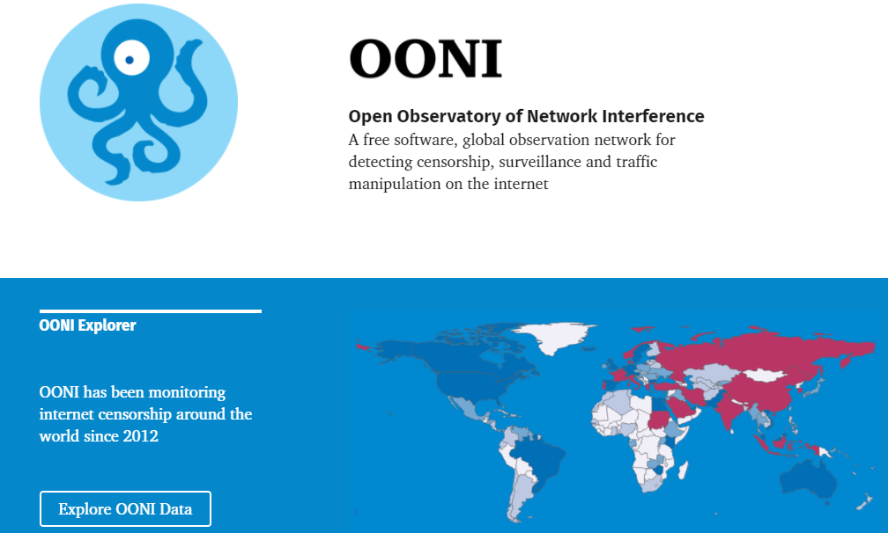

[volver](./)

* [Open Observatory of Network Interference](#open-Observatory-of-network-interference).
* [Técnicas para censurar sitios web](#técnicas-para-censurar-sitios-web)

# Open Observatory of Network Interference

**[OONI](https://ooni.torproject.org/)** [@OpenObservatory](https://twitter.com/openobservatory) (Open Observatory of Network Interference) se definen como un observatorio global de la red para detectar la censura. Es parte del proyecto **[Tor](https://www.torproject.org/)** ([@torproject](https://twitter.com/torproject)).

**OONI** usa software libre para recopilar evidencias de bloqueo de Webs.  

**OONI** confirma el bloque de 25 sitios Web relacionados con el referéndum usando medidas como:

* **“DNS tampering”** (manipulación de DNS)
* **“HTTP blocking”** (bloqueo de HTTP),

Los datos de **OONI** muestran que estos sitios fueron bloqueados cada día desde (al menos) el 25 de septiembre de 2017 (cuando la prueba comenzó) hasta el día del referéndum, el 1 de octubre de 2017.

Para recopilar evidencias que demuestran cómo los sitios asociados al referéndum catalán fueron bloqueados se usa [OONI Probe](https://ooni.torproject.org/install/) (un software gratuito y abierto que cualquiera puede ejecutar para medir el bloqueo de sitios web).

Listado parcial obtenido de OONI con las Webs bloqueadas:

**[referendum.cat](http://referendum.cat/)** fue redirigido al dominio	 **[paginaintervenida.edgesuite.net](http://paginaintervenida.edgesuite.net/)** alojado por Akamai el 13 de septiembre.

**France Telecom Espanña** (AS12479) y **Euskaltel** (AS12338) bloquearon el acceso a sitios mediante la **manipulación de DNS**, mientras que **Telefónica** (AS3352) sirvió páginas de bloque **mediante el uso de proxies transparentes HTTP**. 

Conviene señalar que France Telecom España (AS12479) y Euskaltel (AS12338) no bloquearon ciertos dominios .cat (referendum.cat y ref1oct.cat), probablemente porque estos sitios ya habían sido incautados. Telefónica de España (AS3352), por otro lado, reforzó la censura al servir páginas de bloque para dominios incautados.

A partir del **3 de octubre de 2017**, los siguientes **nombres de dominio son redirigidos a [paginaintervenida.edgesuite.net](http://paginaintervenida.edgesuite.net/)**: piolin.cat, ref1oct.cat, empaperem.cat…

Todos los dominios .cat han sido retirados como resultado de la orden judicial recibida por Fundacio .cat el 15 de septiembre del Tribunal Superior de Justicia de Cataluña. El director de investigación e información de la organización que dirige el dominio catalán de nivel superior .cat, Pep Oliver, fue detenido el 20 de septiembre y mantenido bajo custodia durante 60 horas.

# Técnicas para censurar sitios web 

## DNS tampering (DNS cache poisoning)

## Bloqueo de HTTP(S)

## Apropiación del dominio .CAT

# Enlaces externos

* OONI ["Evidence of Internet Censorship during Catalonia's Independence Referendum"](https://ooni.torproject.org/post/internet-censorship-catalonia-independence-referendum/) (03/10/2017).
* OpenNet Initiative ["About Filtering"](https://opennet.net/about-filtering).
* Ebook ["Access Denied: The Practice and Policy of Global Internet Filtering"](https://books.google.es/books?id=l6ry0NeJ1N8C&pg=PA14&lpg=PA14&dq=DNS+tampering+que+es&source=bl&ots=i93_WnScZe&sig=bvzygiEP2Bxf8j74qNyOEp9ObZc&hl=es&sa=X&ved=0ahUKEwifid6K_IPXAhXJtRQKHQcyAQYQ6AEIeDAJ#v=onepage&q=DNS%20tampering%20que%20es&f=false) 
* ["Update on threats to freedom of expression online in Vietnam"](https://opennet.net/blog/2012/09/update-threats-freedom-expression-online-vietnam).
* ["Evidence of Internet Censorship during Catalonia’s Independence Referendum"](https://www.anonymous-france.eu/blocking-of-catalan-referendum-sites.html) (anonymous - 09/10/2017).